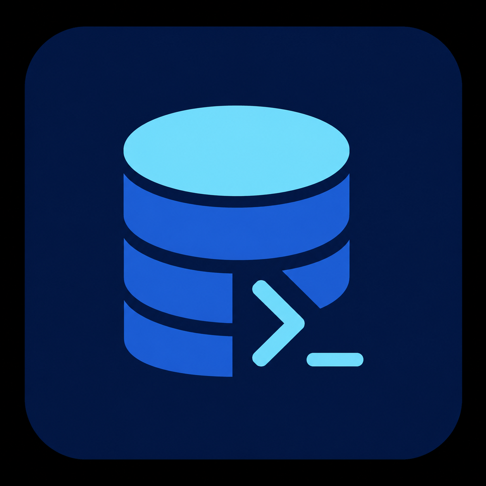

<div align="center">
  
  <h1>Dexo</h1>
  <p>A local-first database workbench for your terminal.</p>

  <p>
    <a href="https://github.com/kingdaswinx/Dexo/releases/latest"></a>
    
    <a href="https://github.com/kingdaswinx/Dexo/actions/workflows/ci.yml"></a>
    
  </p>
</div>

Dexo is a keyboard-first TUI, CLI, and local MCP server for PostgreSQL and MySQL. State stays on disk; secrets stay in the OS keychain; nothing is uploaded.

## Demo

<div align="center">
  <video src="assets/demo.mp4" width="800" controls muted playsinline>
    A short walkthrough of the Dexo workbench.
  </video>
</div>

## Features

- ⌨️ **Keyboard-first workbench** — explorer, SQL editor, results, inspector, and a command palette. Layouts persist per project.
- 🐘 **PostgreSQL and MySQL** — compiled-in official drivers, TLS, SSH tunnels, and SOCKS5/HTTP proxies.
- 🧾 **SQL that stays visible** — statement, selection, or script execution with streaming pages, cancel, and manual transactions.
- 🗂️ **Catalog, data, and schema** — lazy explorer, editable grids, object forms, DDL preview, and live/saved/file schema diff.
- 📦 **Move data safely** — streaming import/export plus native backup/restore that never writes back to the source path.
- 🖥️ **CLI for the same app layer** — query, inspect, schema, export, import, explain, sessions, and doctor without opening the TUI.
- 🔌 **MCP over stdio** — profiles start disabled and read-only; write tools appear only while a temporary grant is active.
- 🔒 **Local-first** — no telemetry, sanitized diagnostics on demand, crash recovery, and dual `MIT OR Apache-2.0` licensing.

## Status

**1.1.0** is the current workspace and changelog release: live schema/diff/transfer/explain, administration, settings, recovery, and policy-enforced multi-connection MCP.

## Install

From a GitHub Release (cargo-dist):

```sh
curl --proto '=https' --tlsv1.2 -LsSf https://github.com/kingdaswinx/Dexo/releases/download/v1.1.0/dexo-installer.sh | sh
```

```powershell
irm https://github.com/kingdaswinx/Dexo/releases/download/v1.1.0/dexo-installer.ps1 | iex
```

Archives always ship. Homebrew and MSI are not claimed until a tap and WiX publisher are configured.

From source, Rust **1.93** is the MSRV:

```sh
cargo install --path crates/dexo
```

## Quick start

```sh
dexo
```

Create a connection in the TUI. Passwords go to the OS keychain, never SQLite.

```sh
dexo query --connection NAME --sql "select 1" --non-interactive
dexo doctor --json
```

`--non-interactive` never prompts. Destructive CLI actions need an explicit confirm flag.

## Compatibility

| Database | Tested versions | Outside the set |
| --- | --- | --- |
| PostgreSQL | 14.18, 16.9, 17.5 | handshake `unverified` |
| MySQL | 8.0.42, 8.4.5, 9.3.0 | 5.7 is EOL / `unverified` |

MariaDB and other Postgres derivatives are not official until they have their own driver and matrix.

| Client | Gate |
| --- | --- |
| Linux | `ci.yml` + `integration.yml` |
| macOS | `ci.yml` native job |
| Windows | `ci.yml` native job |

## CLI

`dexo` with no subcommand starts the TUI. Subcommands reuse `dexo-app`.

```text
dexo connections add --name NAME --driver postgres --host 127.0.0.1 --username USER --database DB
dexo connections list
dexo query --connection NAME --sql "select 1" --format jsonl --non-interactive
dexo schema diff --from A --to B
dexo mcp serve --profile assistant
dexo doctor --json
```

Also: `run`, `inspect`, `export`, `import`, `explain`, `sessions`, `config`, `completion`.

## MCP

Dexo is an MCP **server only** on **stdio**. There is no HTTP listener.

```sh
dexo mcp config print --profile assistant
dexo mcp serve --profile assistant
```

Profiles start disabled and read-only. Write tools require a temporary grant created in the TUI or CLI. The MCP process cannot create grants, list objects outside the allowlist, or put secrets on stdout. Audit logs stay local and sanitized.

## Security and privacy

- Secrets live in the platform keychain behind an opaque `secret_ref`.
- TLS verifies certificates by default; turning verification off is explicit and stays visible.
- SSH tunnels check known hosts; a changed host key needs confirmation.
- No telemetry. Diagnostics are generated only by an explicit action, previewed, and written locally.
- Report vulnerabilities privately — see [SECURITY.md](SECURITY.md).

## Architecture

TUI, CLI, and MCP are adapters over `dexo-app`. Drivers implement contracts and are registered only in the `dexo` binary.

| Crate | Role |
| --- | --- |
| `dexo` | Binary, official driver registry |
| `dexo-app` | Use cases |
| `dexo-tui` / `dexo-cli` / `dexo-mcp` | Adapters |
| `dexo-driver-postgres` / `dexo-driver-mysql` | Official drivers |
| `dexo-sql` / `dexo-storage` / `dexo-secrets` / `dexo-transport` | Shared engines |

Local state is SQLite (schema v11). Official drivers are compiled in; there is no plugin ABI.

## Documentation

- [User docs](docs/src/SUMMARY.md)
- [Changelog](CHANGELOG.md)
- [Contributing](CONTRIBUTING.md)
- [Security policy](SECURITY.md)
- [Code of conduct](CODE_OF_CONDUCT.md)

License: **MIT OR Apache-2.0** (workspace `Cargo.toml`).
