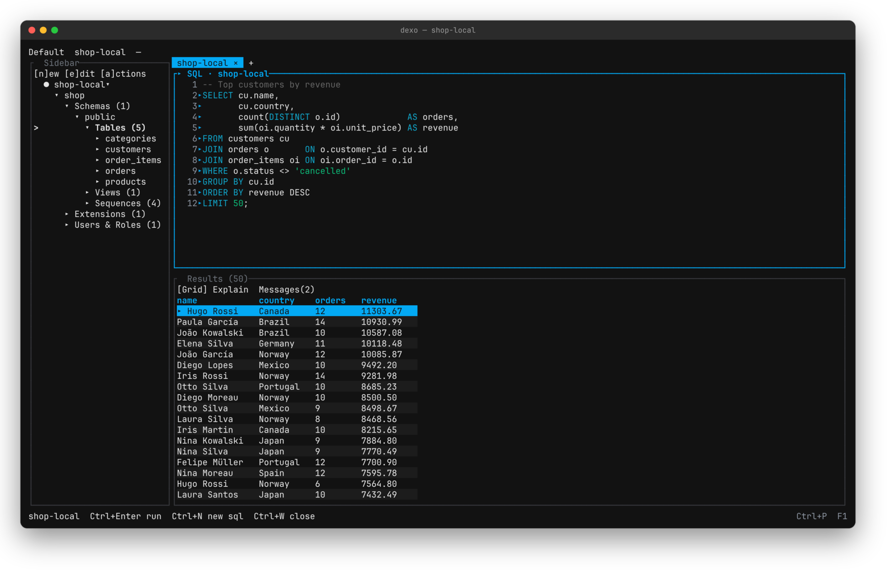
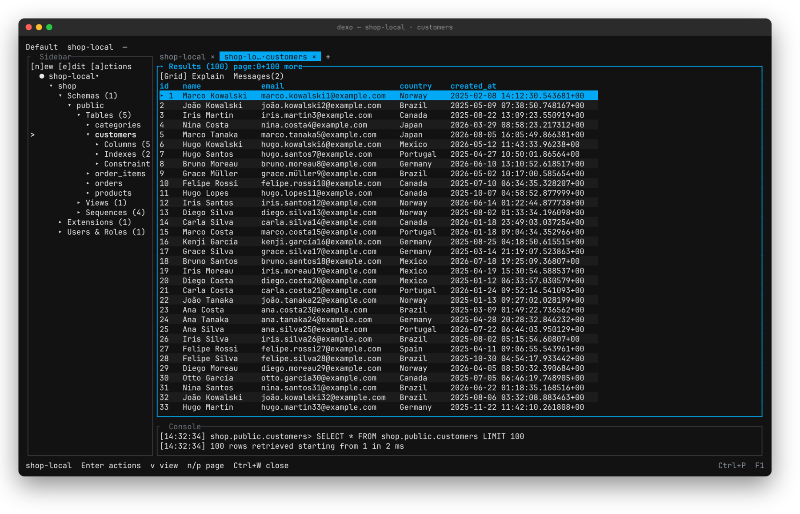
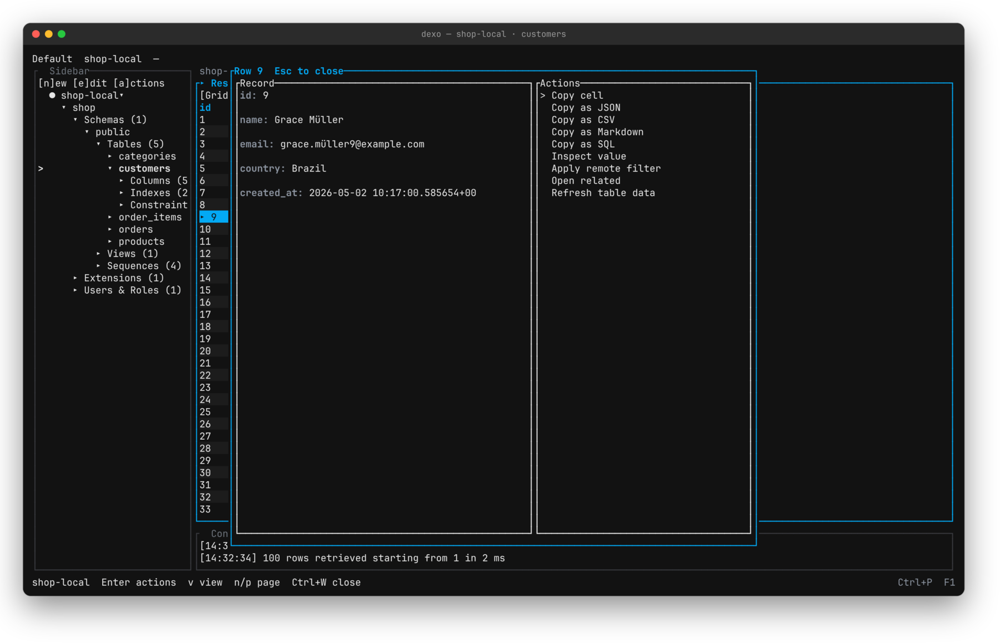
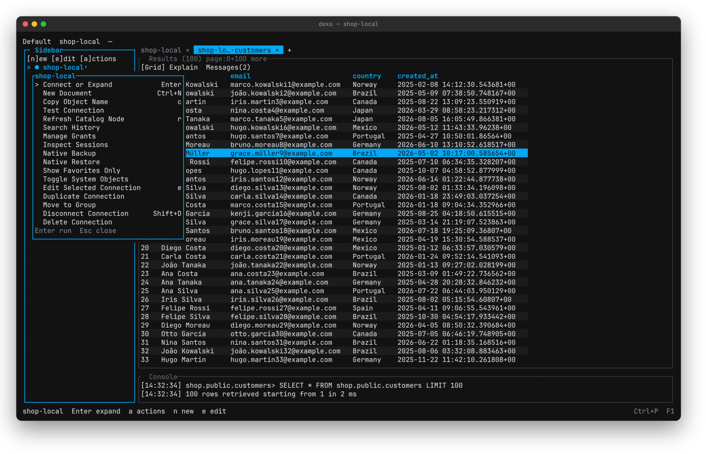
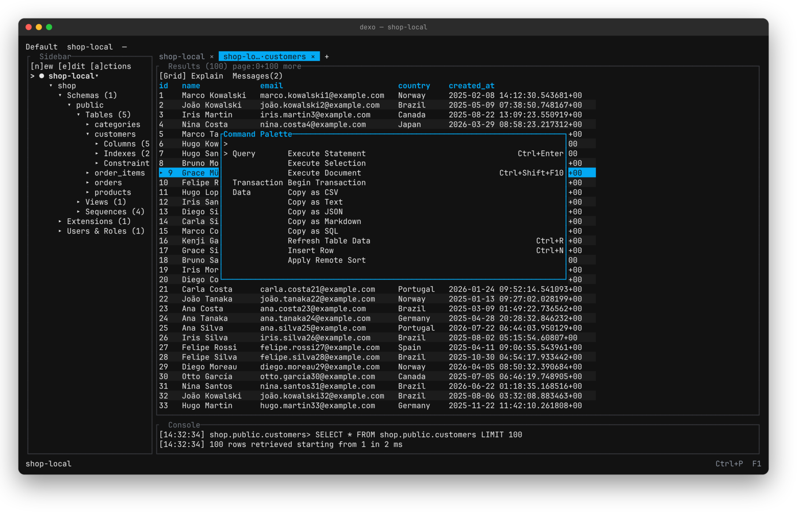
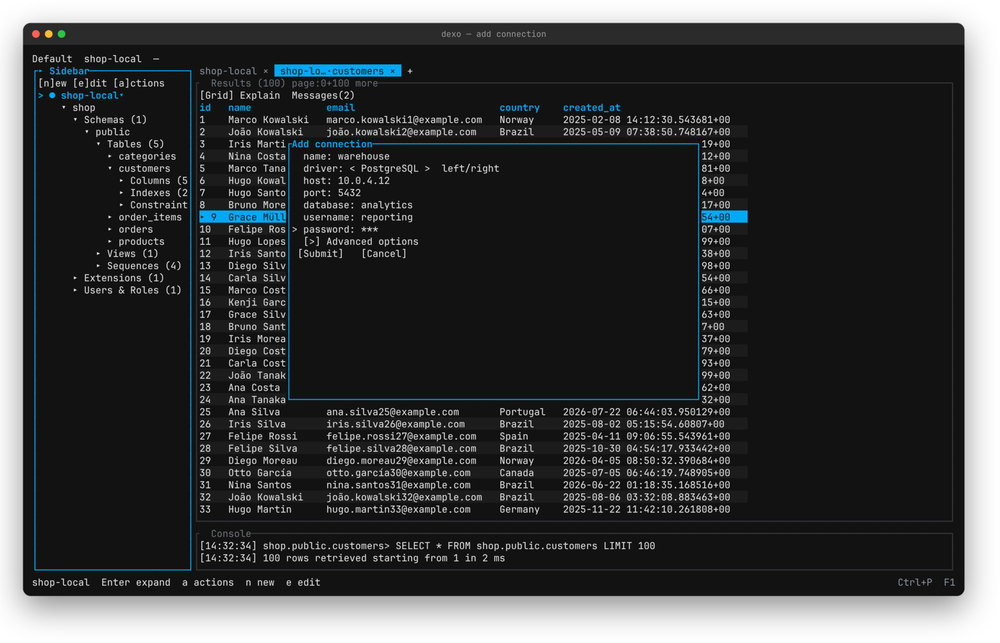
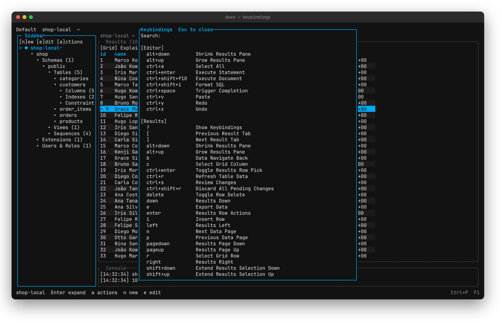
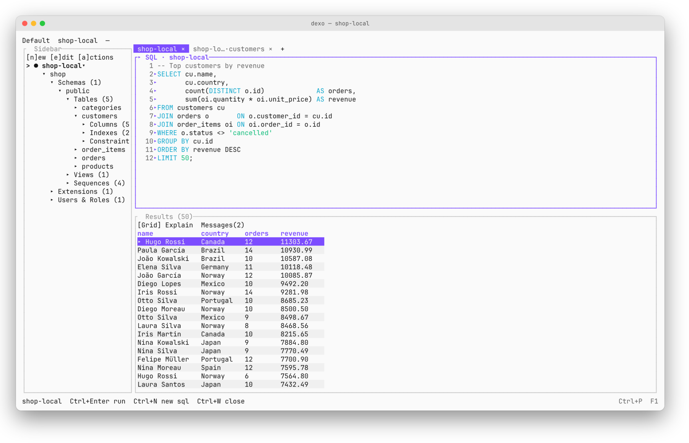
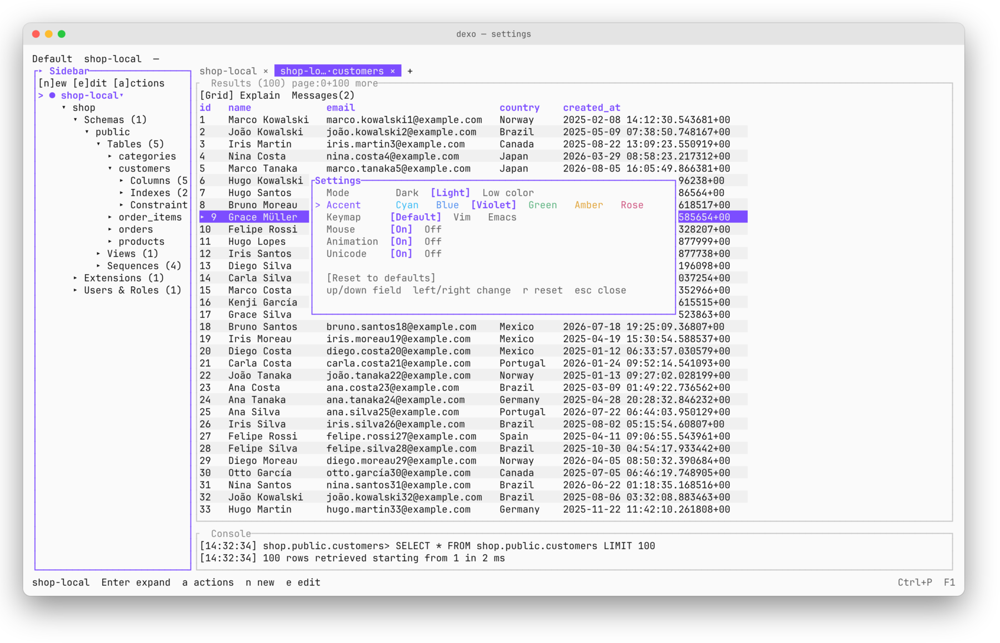

<div align="center">
  
  <h1>Dexo</h1>
  <p>A local-first database workbench for the terminal.</p>

  <p>
    <a href="https://github.com/kingdaswinx/Dexo/releases/latest"></a>
    
    <a href="https://github.com/kingdaswinx/Dexo/actions/workflows/ci.yml"></a>
    
  </p>
</div>

Dexo is a keyboard-driven workbench for PostgreSQL and MySQL. It ships as a terminal UI, a command-line interface, and a local MCP server, all built on the same application layer. Everything it stores stays on your machine: workspace state lives in a local SQLite database, passwords live in the operating system's keychain, and nothing is sent anywhere.

<div align="center">
  
  <br><br>
  
</div>

## Features

- **Workbench** — catalog explorer, SQL editor, results grid, inspector, and a command palette. Every document belongs to a connection, keeps its own results, and reconnects when you return to it. Layouts persist per project.
- **Drivers** — official PostgreSQL and MySQL drivers compiled into the binary, with TLS, SSH tunnels, and SOCKS5/HTTP proxies.
- **Query execution** — run a statement, a selection, or a whole script, with streamed pages, cancellation, and explicit transactions.
- **Data and schema** — lazily loaded catalog, editable grids with a review step before any write, object forms, DDL preview, and schema diff across live databases, saved snapshots, and files.
- **Data transfer** — streaming import and export, plus native backup and restore that never overwrite the source.
- **Command line** — query, inspect, diff, export, import, explain, and diagnose without opening the TUI.
- **MCP server** — stdio only. Profiles start disabled and read-only; write tools appear only while a temporary grant is active.
- **Local-first** — no telemetry, crash recovery for unsaved work, and diagnostics that are generated only on request and previewed before they are written.

## Screenshots

<table>
  <tr>
    <td width="50%"><br><sub><b>Table data.</b> Open a table from the tree; the grid pages on demand and the console logs each fetch.</sub></td>
    <td width="50%"><br><sub><b>Record detail.</b> Enter on a row shows every field, with copy, filter, and refresh actions.</sub></td>
  </tr>
  <tr>
    <td><br><sub><b>Node actions.</b> <kbd>a</kbd> on any tree node lists what it supports, with each shortcut.</sub></td>
    <td><br><sub><b>Command palette.</b> <kbd>Ctrl</kbd>+<kbd>P</kbd> reaches every command, grouped by area.</sub></td>
  </tr>
  <tr>
    <td><br><sub><b>Connections.</b> TLS, SSH, and proxy settings sit under advanced options.</sub></td>
    <td><br><sub><b>Keybindings.</b> <kbd>F1</kbd> lists the active keymap for each pane.</sub></td>
  </tr>
  <tr>
    <td><br><sub><b>Light theme.</b> The same workbench in light mode with the violet accent.</sub></td>
    <td><br><sub><b>Settings.</b> Theme, accent, keymap (Default, Vim, Emacs), mouse, animation, and Unicode.</sub></td>
  </tr>
</table>

## Installation

**Homebrew** (macOS, Linux)

```sh
brew install kingdaswinx/tap/dexo
```

**Scoop** (Windows)

```powershell
scoop bucket add dexo https://github.com/KingDasWinx/scoop-bucket
scoop install dexo
```

**Installer scripts**

```sh
curl --proto '=https' --tlsv1.2 -LsSf https://github.com/kingdaswinx/Dexo/releases/latest/download/dexo-installer.sh | sh
```

```powershell
irm https://github.com/kingdaswinx/Dexo/releases/latest/download/dexo-installer.ps1 | iex
```

**Debian, Ubuntu, Fedora** — download the `.deb` or `.rpm` from the [latest release](https://github.com/kingdaswinx/Dexo/releases/latest) (requires glibc 2.35 or later):

```sh
sudo apt install ./dexo_*_amd64.deb
sudo dnf install ./dexo-*.x86_64.rpm
```

**From source** (Rust 1.93 or later)

```sh
cargo install --locked --git https://github.com/kingdaswinx/Dexo dexo
```

Every release also ships archives for each platform, SHA-256 checksums, and a CycloneDX SBOM. See the [install guide](docs/src/install.md) for details.

## Getting started

Start the workbench:

```sh
dexo
```

Add a connection from the sidebar with <kbd>n</kbd>, or from the command line. Passwords are stored in the operating system's keychain, never in the local database.

```sh
dexo connections add --name local --driver postgres --host 127.0.0.1 --username postgres --database postgres
dexo query --connection local --sql "select version()" --non-interactive
```

| Key | Action |
| --- | --- |
| <kbd>Ctrl</kbd>+<kbd>P</kbd> | Command palette |
| <kbd>Ctrl</kbd>+<kbd>Enter</kbd> | Run the statement under the cursor |
| <kbd>Ctrl</kbd>+<kbd>N</kbd> / <kbd>Ctrl</kbd>+<kbd>W</kbd> | New / close document |
| <kbd>Ctrl</kbd>+<kbd>S</kbd> / <kbd>Ctrl</kbd>+<kbd>O</kbd> | Save / open a SQL file |
| <kbd>Ctrl</kbd>+<kbd>R</kbd> | Refresh the table in the grid |
| <kbd>Alt</kbd>+<kbd>1</kbd> <kbd>2</kbd> <kbd>3</kbd> <kbd>0</kbd> | Focus sidebar, editor, results, tabs |
| <kbd>F1</kbd> | Keybindings reference |
| <kbd>Ctrl</kbd>+<kbd>Q</kbd> | Quit |

The Vim and Emacs keymaps are available under Settings.

## Command line

Running `dexo` without a subcommand starts the TUI. Subcommands share the same application layer.

```sh
dexo connections list
dexo query --connection local --sql "select 1" --format jsonl --non-interactive
dexo schema snapshot --connection local --name before
dexo schema diff --from before --to after
dexo doctor --json
```

Also available: `run`, `inspect`, `export`, `import`, `explain`, `sessions`, `config`, `mcp`, and `completion`. With `--non-interactive`, Dexo never prompts, and destructive actions require an explicit confirmation flag.

## MCP server

Dexo is an MCP server only, over stdio; it opens no network listener.

```sh
dexo mcp config print --profile assistant
dexo mcp serve --profile assistant
```

Profiles start disabled and read-only. Write tools require a temporary grant created from the TUI or the CLI. The MCP process cannot create grants, list objects outside its allowlist, or write secrets to stdout. Audit logs stay local and sanitized.

## Compatibility

| Database | Tested versions |
| --- | --- |
| PostgreSQL | 14.18, 16.9, 17.5 |
| MySQL | 8.0.42, 8.4.5, 9.3.0 |

Other server versions may work, but Dexo reports them as unverified. MySQL 5.7 is end-of-life. MariaDB and other PostgreSQL derivatives are not supported until they have a dedicated driver and test matrix.

Dexo is tested on Linux, macOS, and Windows in CI. Each driver runs its integration suite against the database versions above.

## Security and privacy

- Secrets are stored in the platform keychain and referenced only by an opaque identifier.
- TLS verifies certificates by default; disabling verification is an explicit, visible setting.
- SSH tunnels check known hosts, and a changed host key requires confirmation.
- There is no telemetry. Diagnostics are generated only on request, previewed, and written locally.

Please report vulnerabilities privately as described in [SECURITY.md](SECURITY.md).

## Architecture

The TUI, CLI, and MCP server are adapters over `dexo-app`. Drivers implement shared contracts and are registered only in the `dexo` binary; there is no plugin ABI.

| Crate | Role |
| --- | --- |
| `dexo` | Binary and official driver registry |
| `dexo-app` | Use cases |
| `dexo-tui`, `dexo-cli`, `dexo-mcp` | Adapters |
| `dexo-driver-postgres`, `dexo-driver-mysql` | Official drivers |
| `dexo-sql`, `dexo-storage`, `dexo-secrets`, `dexo-transport` | Shared engines |

Local state is a single SQLite database with versioned migrations.

## Documentation

- [User guide](docs/src/SUMMARY.md)
- [Changelog](CHANGELOG.md)
- [Contributing](CONTRIBUTING.md)
- [Security policy](SECURITY.md)
- [Code of conduct](CODE_OF_CONDUCT.md)

## License

Dexo is dual-licensed under the MIT License or the Apache License 2.0, at your option.
