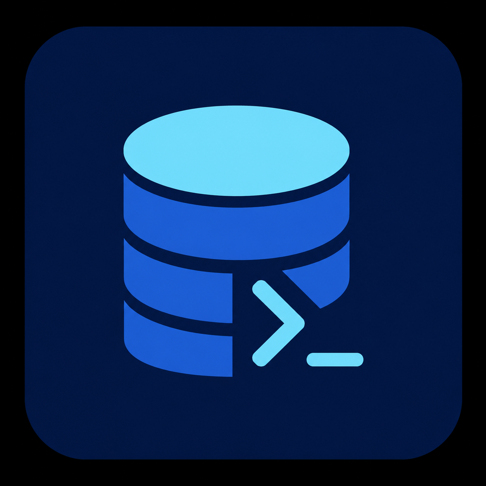
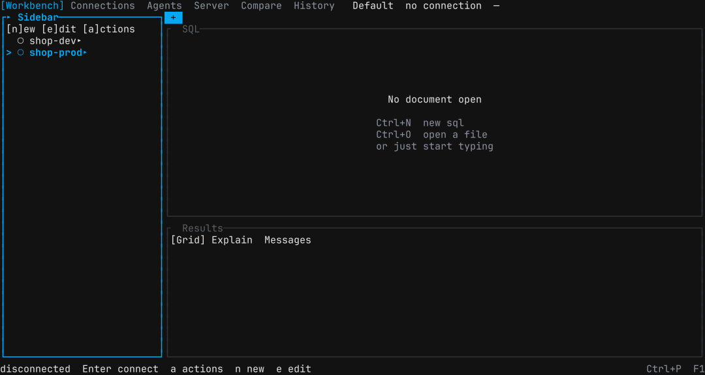
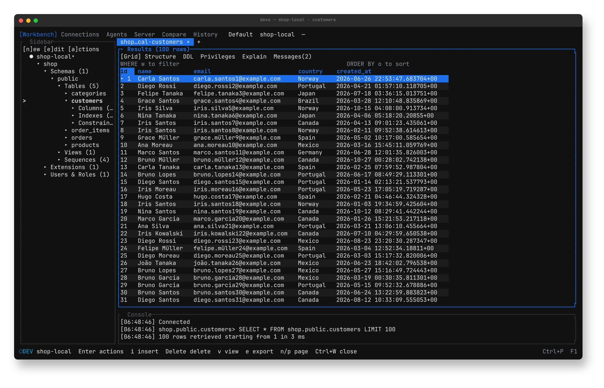
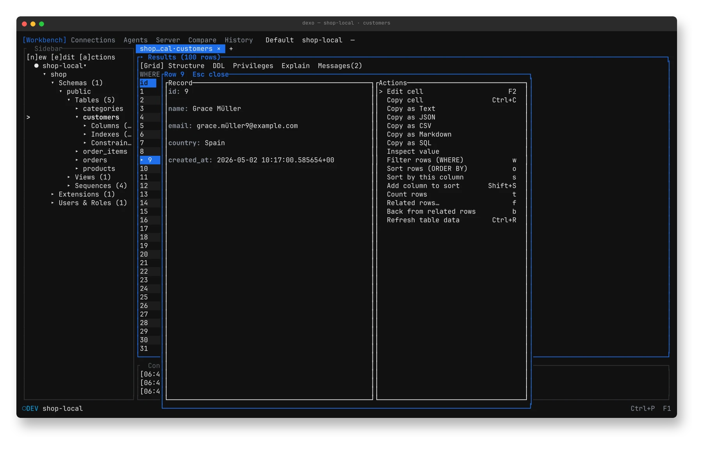
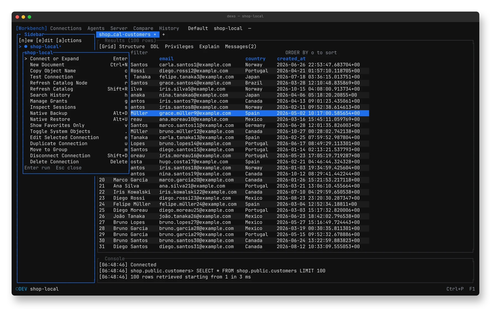
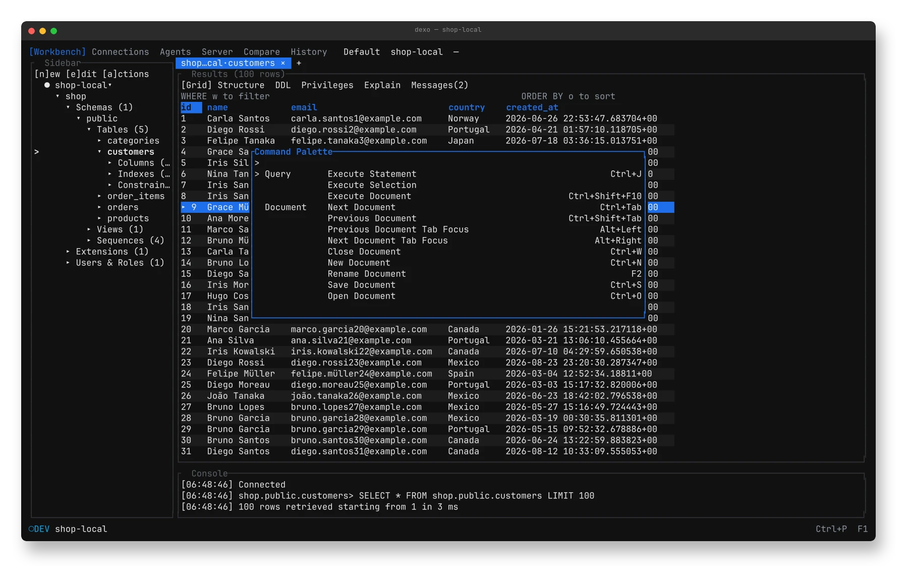
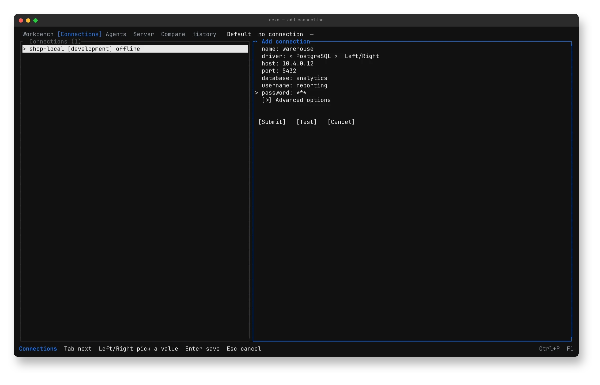
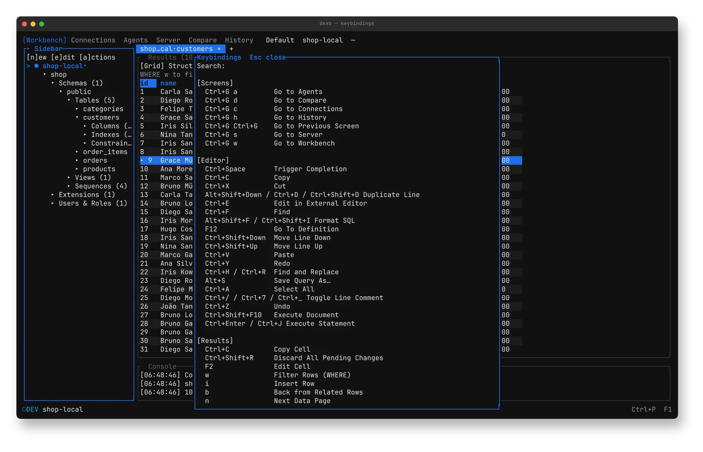
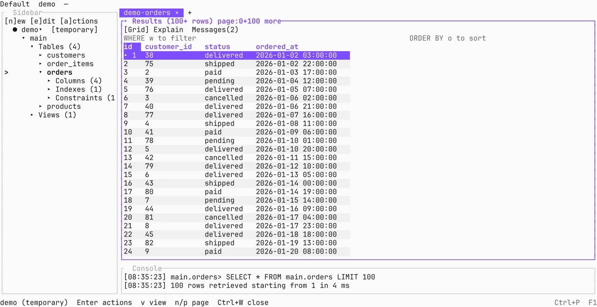
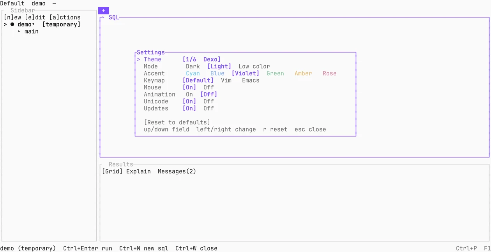

<div align="center">
  
  <h1>Dexo</h1>
  <p>A terminal database workbench with guardrails for AI agents.</p>

  <p>
    <a href="https://github.com/kingdaswinx/Dexo/releases/latest"></a>
    
    <a href="https://github.com/kingdaswinx/Dexo/actions/workflows/ci.yml"></a>
    
  </p>
</div>

Try it on a sample shop, with nothing to connect to:

```sh
brew install kingdaswinx/tap/dexo   # or any install below
dexo --demo
```

Dexo is a keyboard-driven workbench for PostgreSQL, MySQL, MariaDB and SQLite, with DuckDB as a build option. It ships as a terminal UI, a command-line interface, and a local MCP server, all on the same application layer, so the guardrails hold everywhere: a `DELETE` without a `WHERE` on production waits for you to type the connection's name, a read-only connection is read-only on the server too, and an AI agent writes only through a grant you made, each write waiting for your approval if you ask for that. Everything it stores stays on your machine: workspace state lives in a local SQLite database, passwords live in the operating system's keychain, and the only request Dexo makes on its own is a once-a-day check for a newer release.

<div align="center">
  
</div>

<div align="center">
  
</div>

## Questions

**Why not psql, pgcli or mycli?** Keep them for a quick query. Dexo is for the session around it: a catalog tree, results you page, sort, filter and edit in a grid with a review step before anything is written, plans drawn as a tree (with estimated and actual rows on Postgres, MySQL and MariaDB), schema diffs, import and export — for Postgres, MySQL, MariaDB and SQLite in one tool.

**Why not DataGrip or DBeaver?** Dexo starts in a terminal in a moment and runs over SSH, where a desktop IDE cannot. It does not try to be an IDE for every database.

**Why not rainfrog or another TUI?** See the comparison below. In short: query plans drawn as a tree, schema diff with migrations, import, and agents that write only through grants you make, each write approved if you like, are what we did not find in the others.

**Where do the passwords go?** Into the operating system's keychain, or nowhere when a connection reads it from a command such as `pass` or `op read`. Never into Dexo's database, its config files or its logs, and never onto the command line of the tools it runs. A password you write into a URL on Dexo's own command line (`dexo postgres://user:secret@…`) can be seen by other users of the machine while Dexo runs, and Dexo says so; `--password-prompt` asks for it instead.

**Does it need Python?** No. Dexo is one binary: Homebrew, Scoop, the installer scripts, `.deb` and `.rpm`, or `cargo install`.

**Can I try it without risking my data?** `dexo --demo` opens a sample database of its own. On your own databases, mark a connection read-only: Dexo refuses writes in the editor, the grid, the command line and the agents' tools, and the server refuses them too — Postgres, MySQL and MariaDB sessions start read-only, SQLite and DuckDB files open read-only.

## How it compares

| | Dexo | rainfrog | harlequin | lazysql | sqlit |
| --- | --- | --- | --- | --- | --- |
| Built with | Rust, one binary | Rust, one binary | Python | Go, one binary | Python |
| Databases | Postgres, MySQL, MariaDB, SQLite; DuckDB as a build option | Postgres, MySQL, SQLite, Redshift, DuckDB, Oracle | DuckDB, SQLite, Postgres, MySQL and more through adapters | MySQL, Postgres, SQLite, MSSQL, ClickHouse | About 30, through drivers installed on demand |
| Passwords | OS keychain, or a command | OS keychain | Config files, which can name environment variables | Config file, or environment variables | OS keyring, or a command |
| Edit rows in the grid | Yes, reviewed before they are written | — | — | Yes | — |
| Query plans | Tree, with estimated and actual rows on Postgres, MySQL and MariaDB; on Postgres with hypopg, try an index before building it | — | — | — | — |
| Schema diff | Live databases, snapshots and files | — | — | — | — |
| Import | CSV, TSV, JSON, JSON Lines | — | — | — | — |
| Export | CSV, TSV, JSON, JSON Lines, SQL | CSV | Yes | CSV | Query output as CSV or JSON, from its CLI |
| SSH tunnels | Yes | — | Yes (`--ssh-host`) | A command run before connecting | Yes |
| Guarding writes | Read-only connections; on production a write waits for the connection's name; destructive statements are confirmed | Asks before a risky statement and before committing a write; F7 bypasses the check | `--read-only` | Read-only connections (`ReadOnly`, `--read-only`) | — |
| AI agents | MCP server: read-only profiles, allowlists, timed write grants, approval per write | — | `hsql`, a CLI for agents, with `--read-only` and `--timeout` | — | — |

Cells come from each project's README, documentation and changelog, and rainfrog's write checks from its code, as of October 2026; — means we did not find it there.

## Features

- **Workbench** — catalog explorer, SQL editor, results grid, inspector, and a command palette. Every document belongs to a connection, keeps its own results, and reconnects when you return to it. Layouts persist per project.
- **Drivers** — official PostgreSQL, MySQL (which also speaks to MariaDB) and SQLite drivers compiled into the binary, with TLS, SSH tunnels, and SOCKS5/HTTP proxies for the servers. A SQLite connection is just a file path. A build with the `duckdb` feature adds DuckDB, which also opens CSV, Parquet and JSON files as tables.
- **Query execution** — run a statement, a selection, or a whole script, with streamed pages, cancellation, and explicit transactions.
- **Data and schema** — lazily loaded catalog, editable grids with a review step before any write, object forms, DDL preview, and schema diff across live databases, saved snapshots, and files.
- **Data transfer** — streaming import and export, plus native backup and restore that never overwrite the source.
- **Command line** — query, inspect, diff, export, import, explain, and list or cancel server sessions without opening the TUI, held to each connection's policy as the editor is.
- **MCP server** — stdio only. Profiles start disabled and read-only; write tools appear only while a temporary grant is active.
- **Local-first** — no telemetry, crash recovery for unsaved work, and diagnostics that are generated only on request and previewed before they are written.

## Screenshots

<table>
  <tr>
    <td width="50%"><br><sub><b>Table data.</b> Open a table from the tree; the grid pages on demand and the console logs each fetch.</sub></td>
    <td width="50%"><br><sub><b>Record detail.</b> Enter on a row shows every field, with copy, filter, and refresh actions.</sub></td>
  </tr>
  <tr>
    <td><br><sub><b>Node actions.</b> <kbd>a</kbd> on any tree node lists what it supports, with each shortcut.</sub></td>
    <td><br><sub><b>Command palette.</b> <kbd>Ctrl</kbd>+<kbd>P</kbd> reaches every command, grouped by area.</sub></td>
  </tr>
  <tr>
    <td><br><sub><b>Connections.</b> TLS, SSH, and proxy settings sit under advanced options.</sub></td>
    <td><br><sub><b>Keybindings.</b> <kbd>F1</kbd> lists the active keymap for each pane.</sub></td>
  </tr>
  <tr>
    <td><br><sub><b>Light theme.</b> The same workbench in light mode with the violet accent.</sub></td>
    <td><br><sub><b>Settings.</b> Theme, mode, accent, keymap (Default, Vim, Emacs), mouse, animation, Unicode, and the update check.</sub></td>
  </tr>
</table>

## Installation

**Homebrew** (macOS, Linux)

```sh
brew install kingdaswinx/tap/dexo
```

**Scoop** (Windows)

```powershell
scoop bucket add dexo https://github.com/KingDasWinx/scoop-bucket
scoop install dexo
```

**Windows installer or portable** — from the [latest release](https://github.com/kingdaswinx/Dexo/releases/latest), `dexo-x86_64-pc-windows-msvc.msi` installs Dexo under Program Files and adds it to `PATH`; `dexo-x86_64-pc-windows-msvc.exe` runs as is, without installing. Both are unsigned, so Windows SmartScreen may ask for confirmation.

**Installer scripts**

```sh
curl --proto '=https' --tlsv1.2 -LsSf https://github.com/kingdaswinx/Dexo/releases/latest/download/dexo-installer.sh | sh
```

```powershell
irm https://github.com/kingdaswinx/Dexo/releases/latest/download/dexo-installer.ps1 | iex
```

**Debian, Ubuntu, Fedora** — download the `.deb` or `.rpm` from the [latest release](https://github.com/kingdaswinx/Dexo/releases/latest) (requires glibc 2.35 or later):

```sh
sudo apt install ./dexo_*_amd64.deb
sudo dnf install ./dexo-*.x86_64.rpm
```

**From source** (Rust 1.93 or later)

```sh
cargo install --locked --git https://github.com/kingdaswinx/Dexo dexo
```

The release binaries leave DuckDB out: its engine is large. Build it in with the `duckdb` feature:

```sh
cargo install --locked --git https://github.com/kingdaswinx/Dexo dexo --features duckdb
```

Every release also ships archives for each platform, SHA-256 checksums, and a CycloneDX SBOM. See the [install guide](docs/src/install.md) for details.

## Getting started

Start the workbench:

```sh
dexo
```

Try it on a sample shop, with nothing to install or connect to, or open a database straight from its URL without saving a connection:

```sh
dexo --demo
dexo postgres://user@localhost:5432/shop
dexo sqlite:///path/to/file.db
dexo duckdb:///path/to/sales.parquet   # in a build with DuckDB
```

`dexo --password-prompt <url>` asks for the password instead of reading it from the URL, where your shell history would keep it and other users could see it while Dexo runs.

Add a connection from the sidebar with <kbd>n</kbd>, or from the command line. Passwords are stored in the operating system's keychain, never in the local database.

```sh
dexo connections add --name local --driver postgres --host 127.0.0.1 --username postgres --database postgres
dexo query --connection local --sql "select version()" --non-interactive
```

| Key | Action |
| --- | --- |
| <kbd>Ctrl</kbd>+<kbd>P</kbd> | Command palette |
| <kbd>Ctrl</kbd>+<kbd>Enter</kbd> | Run the statement under the cursor |
| <kbd>Ctrl</kbd>+<kbd>N</kbd> / <kbd>Ctrl</kbd>+<kbd>W</kbd> | New / close document |
| <kbd>Ctrl</kbd>+<kbd>S</kbd> / <kbd>Ctrl</kbd>+<kbd>O</kbd> | Save / open a SQL file |
| <kbd>Ctrl</kbd>+<kbd>R</kbd> | Refresh the table in the grid |
| <kbd>Alt</kbd>+<kbd>1</kbd> <kbd>2</kbd> <kbd>3</kbd> <kbd>0</kbd> | Focus sidebar, editor, results, tabs |
| <kbd>F1</kbd> | Keybindings reference |
| <kbd>Ctrl</kbd>+<kbd>Q</kbd> | Quit |

The Vim and Emacs keymaps are available under Settings.

## Command line

Running `dexo` without a subcommand starts the TUI. Subcommands share the same application layer.

```sh
dexo connections list
dexo query --connection local --sql "select 1" --format jsonl --non-interactive
dexo schema snapshot --connection local --name before
dexo schema diff --from before --to after
dexo doctor --json
```

Also available: `run`, `inspect`, `export`, `import`, `explain`, `sessions`, `config`, `mcp`, `completion`, and `lsp`, which brings Dexo's completion, diagnostics and formatting to Neovim, Helix, VS Code or any editor that speaks the Language Server Protocol. With `--non-interactive`, Dexo never prompts, and destructive actions require an explicit confirmation flag.

## MCP server

Dexo is an MCP server only, over stdio; it opens no network listener. Give an agent a profile, the objects it may see, and a place in its client's config:

```sh
dexo mcp profile create --name assistant
dexo mcp profile set --name assistant --connection local --query-mode raw-read
dexo mcp allow --profile assistant --selector 'app.public.*'
dexo mcp profile enable --name assistant --confirm
dexo mcp setup --client claude-code --profile assistant --skill   # or codex, cursor, claude-desktop
dexo mcp doctor --probe
```

Profiles start disabled and read-only. To let the agent write for a while, grant it from the TUI or the CLI; with `--ask`, each write waits in the TUI's Agent Activity (<kbd>Ctrl</kbd>+<kbd>Alt</kbd>+<kbd>A</kbd>) until you approve or deny it:

```sh
dexo mcp grant create --profile assistant --connection local --capability data_write \
  --tool data_update --selector 'app.public.orders' --expires 15m --ask --confirm-target local
```

The MCP process cannot create grants, list objects outside its allowlist, or write secrets to stdout. Audit logs stay local and sanitized. See the [MCP guide](docs/src/mcp.md).

## Compatibility

| Database | Tested versions |
| --- | --- |
| PostgreSQL | 14.18, 16.9, 17.5 |
| MySQL | 8.0.42, 8.4.5, 9.3.0 |
| MariaDB | 10.11, 11.4 |
| SQLite | 3.53.2, built into the binary |
| DuckDB | 1.5.6, built into the binary with the `duckdb` feature |

Other server versions may work but are not tested. MySQL 5.7 is end-of-life. PostgreSQL derivatives are not supported until they have a dedicated driver and test matrix.

Dexo is tested on Linux, macOS, and Windows in CI. Each driver runs its integration suite against the database versions above.

## Security and privacy

- Secrets are stored in the platform keychain and referenced only by an opaque identifier.
- TLS verifies certificates by default; disabling verification is an explicit, visible setting.
- SSH tunnels check known hosts, and a changed host key requires confirmation.
- There is no telemetry. Diagnostics are generated only on request, previewed, and written locally.
- Once a day, Dexo asks GitHub which release is the latest, to tell you when an update is out. The request carries only the running version in its `User-Agent`. Turn it off under Settings → Updates, or with `DEXO_NO_UPDATE_CHECK=1`.

Please report vulnerabilities privately as described in [SECURITY.md](SECURITY.md).

## Architecture

The TUI, CLI, and MCP server are adapters over `dexo-app`. Drivers implement shared contracts and are registered only in the `dexo` binary; there is no plugin ABI.

| Crate | Role |
| --- | --- |
| `dexo` | Binary and official driver registry |
| `dexo-app` | Use cases |
| `dexo-tui`, `dexo-cli`, `dexo-mcp` | Adapters |
| `dexo-driver-postgres`, `dexo-driver-mysql`, `dexo-driver-sqlite`, `dexo-driver-duckdb` | Official drivers |
| `dexo-sql`, `dexo-storage`, `dexo-secrets`, `dexo-transport` | Shared engines |

Local state is a single SQLite database with versioned migrations.

## Documentation

- [User guide](docs/src/SUMMARY.md)
- [Changelog](CHANGELOG.md)
- [Contributing](CONTRIBUTING.md)
- [Security policy](SECURITY.md)
- [Code of conduct](CODE_OF_CONDUCT.md)

## Reporting bugs

Found a bug or something that behaves oddly? Tell us through the [bug report form](https://forms.gle/gw1i6tGgVsJsgCxGA). Security issues go privately through [SECURITY.md](SECURITY.md) instead.

## License

Dexo is dual-licensed under the MIT License or the Apache License 2.0, at your option.
