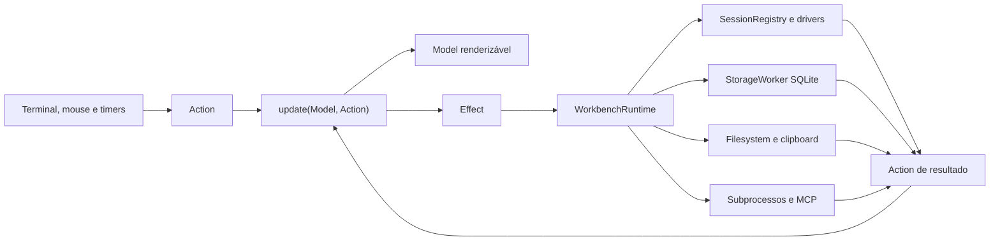

# Dexo — Design de Fechamento Funcional da TUI

**Data:** 2026-08-15  
**Status:** aprovado em brainstorming; aguardando revisão final do documento  
**Documento-base:** `docs/superpowers/specs/2026-08-14-dexo-product-design.md`

## 1. Propósito

Este documento define como transformar a TUI atual do Dexo, hoje majoritariamente composta por layout, reducers e fixtures, em uma aplicação que executa operações reais sobre PostgreSQL, MySQL, filesystem, SQLite, keychain e servidor MCP local.

Ele não substitui a especificação original. A spec de produto continua sendo a fonte de verdade sobre escopo, segurança, privacidade, plataformas e experiência. Este documento registra a arquitetura de integração, os defeitos concretos encontrados na implementação e a divisão do fechamento funcional em exatamente sete planos sequenciais.

## 2. Decisões herdadas

Permanecem aprovadas:

- paridade ampla com workbenches como DataGrip;
- Linux, macOS e Windows;
- experiência híbrida TUI e CLI;
- armazenamento exclusivamente local;
- segredos no keychain do sistema;
- drivers oficiais modulares;
- proteções configuráveis;
- licença permissiva MIT ou Apache-2.0;
- servidor MCP somente local;
- transporte MCP por `stdio`, iniciado sob demanda;
- MCP read-only por padrão;
- concessões mutáveis temporárias;
- allowlist granular e capacidades separadas;
- administração de MCP pela TUI e CLI.

## 3. Diagnóstico confirmado no código

### 3.1 Runtime da TUI

`crates/dexo-tui/src/event.rs` cria um `Model`, lê eventos e aplica reducers, mas `apply_effect()` trata somente `Effect::CreateConnection`. A sessão retornada pelo driver é descartada logo após o connect. Os demais efeitos são ignorados.

Consequências:

- `StartScript` não executa;
- `CancelQuery` não chega à sessão;
- begin, commit e rollback não chegam ao driver;
- `PersistLayout` não persiste;
- o status conectado não corresponde a uma sessão viva.

### 3.2 Reducers e overlays

`crates/dexo-tui/src/update.rs` abre fixtures para schema diff, transfer, backup, restore, explain, admin, MCP, settings, recovery e audit. Algumas ações mutáveis apenas alteram estado local ou adicionam mensagens como `ddl queued`.

O código visual é útil e deve ser preservado, mas não pode continuar sendo usado como prova de execução.

### 3.3 Editor

O editor renderiza `Model.sql: String`. A TUI não encaminha teclas comuns para edição e não usa o `dexo-sql::SqlDocument` já implementado. Cursor, seleção, undo, redo, parse incremental, highlight, autocomplete, format, snippets e parâmetros existem parcial ou totalmente em crates inferiores, porém não compõem a TUI.

### 3.4 Query e drivers

Os drivers possuem streaming, cancelamento, transações e diversas capacidades reais, mas há lacunas adicionais:

- PostgreSQL e MySQL ignoram `QueryRequest.parameters` no caminho principal;
- `QueryRequest.timeout` não é imposto pelo executor;
- rows affected frequentemente é retornado como `None`;
- notices do PostgreSQL não entram em `QueryEvent`;
- cancelamento PostgreSQL abre o cancel socket com `NoTls`;
- cancelamento MySQL precisa respeitar a geração da sessão e o transporte ativo;
- a TUI cria inicialmente um `QueryRequest::read` mesmo para statements mutáveis;
- `QueryService::start()` não devolve um handle completo que correlacione task, query e cancelamento;
- múltiplos result sets não possuem lifecycle explícito no contrato.

### 3.5 Transporte

`dexo-transport` implementa TCP, TLS, CA customizada, certificado de cliente, SSH, verificação de host key, SOCKS5 e HTTP CONNECT. Entretanto, `ConnectRequest` contém apenas endpoint, database, username, secret e read-only. Os drivers conectam diretamente e o formulário não consegue ativar os transportes existentes.

A API atual de PostgreSQL aceita stream fornecido pelo chamador por `connect_raw`. `mysql_async` oferece TLS nativo, mas não um transporte público arbitrário equivalente. SSH e proxy exigirão um forwarder TCP local efêmero compartilhado pela estratégia de conexão.

### 3.6 Persistência

Os repositórios locais existem, porém não oferecem todos os CRUDs e vínculos necessários:

- projetos não possuem delete nem lookup por nome;
- documentos só possuem save;
- histórico não possui listagem nem limpeza filtrada;
- snippets não pertencem a projeto;
- layout existe, mas a TUI não o chama;
- preferences existem, mas a TUI não as carrega nem aplica;
- recovery existe, mas os overlays usam fixture;
- não existe persistência suficiente para recentes, grupos, favoritos e múltiplas referências de segredo.

### 3.7 Catálogo, dados e engenharia

Os serviços e contratos principais já existem, mas não são compostos pela TUI. Além disso:

- dependências e dependentes do catálogo MySQL retornam listas vazias;
- o preview DDL da TUI gera texto genérico em vez do SQL do driver;
- o contrato `DdlExecutor` executa um plano, mas não planeja `SchemaChange` de modo modular;
- viewers de valor representam lazy loading, porém não possuem backend real;
- change sets não são enviados ao `DataMutator` pela TUI;
- `fake_pg_dump` e `FakeChild` estão em código de produção;
- file picker, clipboard do sistema e subprocessos reais não são compostos.

### 3.8 MCP

O servidor MCP, policy engine, grants, audit e ledger possuem implementação relevante. A CLI já persiste grande parte do lifecycle. A TUI ainda usa fixtures. O servidor também cria no máximo uma sessão usando a primeira conexão do perfil, embora o perfil possa permitir várias conexões. Catálogo, resources, tools e grants precisam ser roteados por conexão sem misturar namespaces.

### 3.9 Testes e CI

Em 2026-08-15, `cargo test --workspace --no-fail-fast` terminou sem falhas: 304 testes executados e 38 integrações ignoradas.

O workflow `.github/workflows/integration.yml` configura uma matriz de imagens PostgreSQL/MySQL, mas executa `cargo test` sem `--ignored`. Como os contratos Docker usam `#[ignore = "requires Docker"]`, o job atual pode ficar verde sem executar a integração real.

O workflow de release também contém SBOM placeholder e constrói somente um artefato Linux.

## 4. Estratégia escolhida

Foi escolhida uma arquitetura de runtime assíncrono orientado a efeitos. O reducer permanece puro; recursos reais ficam fora do `Model`.

Alternativas rejeitadas:

- executar todo I/O diretamente em `event.rs`, pois bloquearia frames e criaria um módulo monolítico;
- adotar atores/CQRS para cada componente, pois adicionaria infraestrutura especulativa antes de entregar funcionalidade.

## 5. Arquitetura-alvo



### 5.1 Fronteiras

`Model` contém somente estado seguro para renderização. Ele não contém `Session`, conexão SQLite, stream, handle de processo, token de cancelamento ou segredo exposto.

`Action` representa input ou resultado observável. Resultados assíncronos carregam IDs suficientes para rejeitar eventos stale.

`Effect` representa intenção de I/O. Todo variant alcançável deve possuir handler real ou ser removido.

`WorkbenchRuntime` possui os recursos e despacha efeitos sem bloquear o loop.

### 5.2 Módulos iniciais

A implementação deverá começar com:

- `crates/dexo-tui/src/runtime/mod.rs` — bootstrap, despacho e shutdown;
- `crates/dexo-tui/src/runtime/session_registry.rs` — sessões vivas e políticas;
- `crates/dexo-tui/src/runtime/storage_worker.rs` — thread proprietária do SQLite;
- `crates/dexo-tui/src/runtime/query_runner.rs` — streaming, scripts e cancelamento.

Outros módulos serão adicionados por domínio somente quando houver comportamento real a isolar.

### 5.3 Loop principal

O loop usa `tokio::select!` sobre:

- eventos do terminal;
- ações produzidas pelo runtime;
- ticks de recovery, countdown e refresh;
- sinais de encerramento.

Despachar um efeito não pode aguardar a operação inteira. Batches e progresso retornam pelo canal interno. Canais devem ser bounded.

### 5.4 Correlação

Operações assíncronas carregam, conforme aplicável:

- `OperationId`;
- `SessionId`;
- `ConnectionId`;
- `DocumentId` ou `PanelId`;
- geração da sessão;
- geração da requisição.

O reducer ignora resultados que não pertencem mais à sessão, documento, aba ou geração ativos.

### 5.5 StorageWorker

Uma thread dedicada possui `dexo_storage::Database` e recebe comandos por `std::sync::mpsc`. Respostas usam `tokio::sync::oneshot` ou retornam como ações do runtime. Isso evita compartilhar `rusqlite::Connection` e impede SQLite de bloquear frames.

### 5.6 Shutdown

O encerramento seguro:

1. impede novas operações;
2. pede confirmação para transações ativas;
3. cancela queries, transfers e subprocessos;
4. fecha sessões;
5. persiste documentos e layout;
6. marca shutdown limpo;
7. restaura o terminal.

## 6. Sessões e conexões

### 6.1 Perfil versus sessão

`ConnectionProfile` é persistido. `ActiveSession` é efêmera e possui:

- `SessionId`;
- `ConnectionId`;
- `Arc<dyn Session>`;
- finalidade: editor, catálogo, administração ou MCP;
- estado transacional;
- política efetiva;
- health/status;
- geração;
- operações ativas;
- lease de transporte opcional.

Um perfil pode ter várias sessões. Um documento seleciona uma sessão específica. Transações nunca são compartilhadas implicitamente entre documentos.

### 6.2 Reconnect

Reconnect automático é permitido somente para operação comprovadamente read-only, sem transação ativa/falha/desconhecida e sem replay ambíguo. DML, DDL, grants, administração, commit e rollback nunca são repetidos automaticamente.

Queda durante transação leva a `Unknown` e exige reconnect explícito.

### 6.3 Transporte

O contrato canônico de conexão representa:

- TLS e verificação;
- CA customizada;
- certificado/chave de cliente;
- SSH, autenticação e host key;
- SOCKS5 ou HTTP CONNECT;
- timeouts;
- read-only explícito.

SSH e proxy usam `TransportLease`: listener local em porta efêmera que encaminha cada conexão ao destino real. O lease suporta conexões auxiliares de cancelamento e termina junto com a sessão. TLS continua ponta a ponta no driver e valida o hostname original.

### 6.4 Segredos

Não existe fallback silencioso. Keychain bloqueado, indisponível ou sem segredo produz `SecretRequired`.

O usuário escolhe entre:

- usar somente nesta sessão;
- salvar no keychain;
- cancelar.

Uma conexão pode ter referências separadas para senha do banco, senha SSH, passphrase SSH, senha do proxy e passphrase TLS. SQLite guarda apenas referências. Remover conexão pergunta se deve remover os itens do keychain.

Buffers temporários de segredo usam `Debug` redigido e limpeza após submit/cancelamento.

### 6.5 Ambientes customizados

O label de ambiente é livre, mas a política efetiva é persistida explicitamente. Ambiente desconhecido não herda silenciosamente a política local.

### 6.6 Registro modular de drivers

A TUI não deve decidir campos, porta padrão ou capabilities por `match` hardcoded em `postgres` e `mysql`. O registro expõe um descriptor seguro de cada driver oficial, incluindo ID, nome, porta padrão, opções de conexão suportadas e capabilities estáticas. Opções específicas continuam versionadas dentro de `config`, validadas pelo driver.

Novos bancos continuam sendo adicionados como crates oficiais registrados no binário; esta fase não introduz ABI dinâmica nem carregamento de bibliotecas não confiáveis.

## 7. Bootstrap e estado local

A abertura da TUI segue:

1. descobrir `AppPaths`;
2. abrir e migrar SQLite no worker;
3. carregar preferences;
4. carregar ou criar projeto padrão;
5. restaurar projeto recente, layout e documentos;
6. verificar recovery;
7. listar conexões do projeto;
8. restaurar somente metadados, sem conectar automaticamente;
9. detectar capacidades do terminal;
10. renderizar o primeiro frame.

O projeto ativo usa `ProjectId`, não o texto `default`.

Migrations append-only, iniciando após a versão atual 7, devem cobrir no mínimo:

- projeto ativo e recentes;
- grupos e políticas de conexão;
- referências de segredo por finalidade;
- snippets e histórico por projeto;
- favoritos e recência de catálogo;
- tabs/documentos e vínculo de sessão;
- snapshots de plano quando implementados.

Dados existentes devem sobreviver às migrations e backups pré-migração.

## 8. Arquivos e recovery

Documentos possuem estados explícitos: scratch, limpo, modificado, conflito externo e recuperado.

Save usa temporário no mesmo diretório e rename. Conflito por fingerprint oferece recarregar, comparar ou salvar como. Arquivos externos nunca são apagados implicitamente com o projeto.

Recovery usa debounce e checkpoints em eventos importantes. Não persiste parâmetros sensíveis, segredos ou handles. Shutdown só é marcado limpo após o flush final.

## 9. Divisão em sete planos

### 9.1 Plano 1 — Núcleo operacional e editor SQL

Escopo:

- runtime, storage worker e session registry mínimos;
- retenção de sessão viva;
- execução de seleção, statement e documento;
- classificação read/write conservadora;
- parâmetros tipados PostgreSQL/MySQL;
- timeout, batches, notices, rows affected e erros;
- lifecycle real de result sets;
- cancelamento;
- begin, commit, rollback e savepoints;
- editor `SqlDocument`, cursor, seleção, Unicode, undo/redo;
- highlight, diagnósticos, autocomplete e format preview;
- snippets, parâmetros e histórico;
- arquivos `.sql`, scratch e recovery mínimo;
- primeira grade alimentada por rows reais.

Saída: é possível abrir a TUI, conectar, digitar SQL, executar, cancelar, transacionar, salvar e reabrir trabalho real em ambos os bancos.

### 9.2 Plano 2 — Gerenciamento completo de conexões

Escopo:

- lista, seleção, troca, edit, duplicate, test e delete;
- escolha sobre remoção do keychain;
- grupos e ambientes customizados;
- formulário e defaults derivados do descriptor modular do driver;
- TLS, CA, mTLS, SSH e proxy ponta a ponta;
- host-key confirmation;
- prompt de segredo;
- múltiplas sessões por perfil;
- read-only e reconnect seguro;
- bootstrap de perfis existentes;
- fechar sessão ou todas as sessões do perfil.

Saída: todo campo de conexão visível altera o connect real ou fica desabilitado com explicação.

### 9.3 Plano 3 — Projetos e estado local

Escopo:

- create, rename, open e delete de projeto;
- default e recentes reais;
- vínculos de conexões, documentos, snippets, favoritos e layout;
- mover/desassociar recursos;
- persistir/restaurar layout, tabs, foco e documento ativo;
- CRUD completo de documentos e snippets;
- histórico filtrado e limpeza;
- export/import de config pela TUI;
- conflitos e segredos pendentes visíveis.

Saída: reiniciar o Dexo restaura o projeto e nenhum recurso local vira fixture ou estado órfão.

### 9.4 Plano 4 — Explorer e catálogo

Escopo:

- árvore real e lazy;
- loading, error, retry, refresh de nó/subtree/global;
- filtros, busca, favoritos e recência;
- properties, DDL, data, dependencies e dependents;
- copy name/qualified/DDL no clipboard do SO;
- go-to-definition e inserção de identificador;
- effective privileges;
- snapshots offline, staleness e fallback;
- implementação real de dependências MySQL ou capability reason explícita.

Saída: explorer online/offline reflete o banco e nunca confunde falta de permissão com lista vazia.

### 9.5 Plano 5 — Resultados e edição de dados

Escopo:

- grids reais e tabs independentes;
- seleção completa;
- paging, sort e filter remotos em data tabs;
- rerun derivado somente para SELECT validável;
- clipboard CSV/TSV/JSON/Markdown/SQL;
- export de seleção;
- viewers JSON/XML/array/bytes/imagem;
- valores grandes por fetch remoto confiável ou spool temporário bounded;
- change sets, review e apply transacional;
- conflitos por identidade/original values;
- retry, reload e revert;
- FK navigation real e breadcrumbs;
- read-only sem identidade segura.

Saída: consultar e editar dados modifica o banco somente após review e confirmação aplicáveis.

### 9.6 Plano 6 — Schema, diff, transfer e explain

Escopo:

- planner DDL modular no contrato de driver;
- forms e preview com SQL real por banco;
- dependencies, grants, riscos, locks e rollback;
- apply protegido e cache invalidation;
- raw DDL conservador;
- snapshots live/local/imported;
- diff estrutural, seleção, forward/reverse e apply;
- export/import streaming;
- file picker TUI multiplataforma;
- backup/restore por ferramentas nativas reais;
- discovery/version, progresso, stderr sanitizado, cancel e cleanup;
- explain do statement atual, analyze opt-in e raw plan;
- snapshots e comparação de planos.

Saída: nenhum fluxo de engenharia abre preview/progresso fixture e nenhum subprocesso fake permanece em produção.

### 9.7 Plano 7 — Administração, settings, recovery, MCP e acessibilidade

Escopo:

- sessões, queries, locks e blocking graph;
- cancel, terminate e manutenção protegidos;
- sizes, statistics e variables;
- roles, users, grants, revokes e privilégios;
- settings persistidas e aplicadas;
- temas/keymaps externos com rollback de inválido;
- mouse para foco, tabs, scroll, seleção, botões e resize;
- recovery e diagnostics reais;
- CRUD de perfis MCP;
- selectors, tools, connections, limites e query mode;
- router MCP multi-conexão;
- grants temporários, countdown, revoke e audit persistidos;
- resources, prompts e tools previstos na spec original;
- progresso, paginação de resultados, concorrência e cancelamento MCP;
- servidor stdio stdout-pure;
- teclado integral, marcadores sem cor, fallback Unicode;
- gate global, CI, release, SBOM, docs e matriz de capacidades.

Saída: a spec inteira está funcional, os gates executam operações reais e os artefatos existem para as três plataformas.

## 10. MCP multi-conexão

Um `McpConnectionRouter` associa nomes/IDs permitidos a sessões e catálogos. Quando um perfil permite mais de uma conexão, tools que acessam banco exigem conexão explícita. Resources incluem a conexão no URI. Busca e describe não misturam objetos de origens diferentes.

Grants continuam sendo criados somente pela UX local TUI/CLI. Tool mutável exige simultaneamente:

- perfil habilitado;
- conexão permitida;
- tool rule;
- selector permitido;
- capability específica;
- grant válido, não revogado, não expirado e com uso restante;
- `operation_id` idempotente.

## 11. Modelo de operação e erros

Toda operação segue:

```text
Idle -> Pending -> Succeeded
                -> Failed
                -> Cancelled
                -> Partial/Unknown
```

`Partial/Unknown` é obrigatório quando o servidor não confirmou atomicidade, incluindo queda em transação, DDL MySQL parcialmente committed, restore interrompido e cancelamento ambíguo.

Erros carregam categoria pública, mensagem segura, contexto de operação e detalhe técnico somente para log sanitizado. Falha de uma operação não encerra o loop.

## 12. Regra contra funcionalidade falsa

Um teste estrutural deve falhar quando:

- código de produção chama `fixture*`;
- um `Effect` alcançável não possui handler;
- ação mutável termina somente alterando `Model`;
- mensagem de sucesso nasce antes da resposta de I/O;
- comando habilitado da palette não possui fluxo funcional;
- driver anuncia capability cujo contrato retorna placeholder;
- CI Docker executa zero testes.

Fixtures permanecem válidas em testes, snapshots e builders de dados de teste.

## 13. Estratégia de testes

Cada feature possui:

1. teste de reducer, limitado à transição pura;
2. teste de runtime `Effect -> serviço -> Action`;
3. integração PostgreSQL/MySQL quando houver banco;
4. fluxo TUI com eventos injetados e terminal gravável;
5. black-box do binário para filesystem, subprocessos, CLI e MCP quando aplicável.

Testes usam tempdirs, SQLite temporário, relógio controlável e secret store de teste. Keychain nativo possui smoke separado, pois runners headless podem não oferecer serviço de credenciais.

O workflow de integração deve executar explicitamente os testes ignorados e falhar se a contagem for zero.

## 14. Gates

Todo plano termina com:

```powershell
cargo fmt --all -- --check
cargo clippy --workspace --all-targets --all-features -- -D warnings
cargo test --workspace --all-features --no-fail-fast
```

E com os contratos Docker relevantes por `--ignored --nocapture`.

O Plano 7 executa:

- matriz PostgreSQL/MySQL completa;
- Linux, macOS e Windows;
- MCP protocol/conformance;
- migrations e recovery forçado;
- fuzz/property smoke;
- performance integrada;
- security/sentinel;
- docs e artefatos instaláveis.

## 15. Desempenho

Devem permanecer válidos os budgets da spec original:

- primeiro frame e input responsivos;
- nenhum I/O bloqueante no frame;
- canais bounded e backpressure;
- render proporcional à viewport;
- buffer de resultados e temporários limitados;
- catálogo de 100 mil objetos;
- export de um milhão de linhas sem collect integral;
- parse incremental;
- cancelamento responsivo.

Benchmarks devem medir o runtime integrado, não apenas fixtures ou estruturas isoladas.

## 16. Segurança e privacidade

Sentinelas verificam ausência de segredos em SQLite, TOML, logs, histórico, recovery, temporários, audit, diagnostics, argumentos e ambiente de subprocessos.

Também são obrigatórios testes para keychain bloqueado, TLS inválido, host key alterada, read-only, grant expirado/revogado, confirmação destrutiva ausente e evento stale após troca de sessão.

Nenhum dado é enviado à nuvem e diagnostics nunca faz upload.

## 17. Ordem de execução

Os planos são sequenciais:

```text
1 Núcleo
  -> 2 Conexões
  -> 3 Projetos
  -> 4 Catálogo
  -> 5 Resultados
  -> 6 Engenharia
  -> 7 Operações e conclusão
```

Cada plano começa sobre o gate verde do anterior. A ordem evita alterações concorrentes incompatíveis em `Model`, `Action`, `Effect`, runtime e migrations.

## 18. Definition of Done global

O fechamento funcional termina somente quando:

- todos os itens das sete áreas têm teste de aceitação;
- nenhum overlay ou rota de produção carrega fixture;
- todos os efeitos alcançáveis possuem execução real;
- conexões, arquivos, settings e projetos sobrevivem a restart;
- PostgreSQL e MySQL passam pelos fluxos TUI correspondentes;
- capacidade anunciada funciona ou exibe indisponibilidade real;
- operações mutáveis usam confirmação e resultado do driver;
- MCP usa policy, grants e audit persistidos;
- recovery é comprovado após encerramento forçado;
- CI executa de fato os containers;
- release produz artefatos Linux/macOS/Windows, checksums e SBOM real;
- documentação e matriz de capacidades refletem testes executados;
- a spec original não possui requisito funcional aberto.

## 19. Riscos e mitigação

### 19.1 Runtime central crescer demais

Mitigação: runtime coordena; módulos por domínio executam. Não criar um service por tela sem comportamento próprio.

### 19.2 Mudança ampla de contratos de driver

Mitigação: ampliar contratos por capacidades pequenas e adicionar contract tests para ambos os drivers antes de integrar a TUI.

### 19.3 Transporte inconsistente entre drivers

Mitigação: forwarder local uniforme para SSH/proxy, TLS nativo ponta a ponta e testes de cancelamento através do mesmo lease.

### 19.4 SQLite bloquear render

Mitigação: owner thread única e canais bounded.

### 19.5 Evento stale corromper tela

Mitigação: IDs e gerações obrigatórios em toda ação assíncrona.

### 19.6 Falsa cobertura por snapshots

Mitigação: snapshots cobrem render; acceptance tests comprovam I/O e a CI falha quando integração executa zero casos.

### 19.7 Plano 7 excessivamente amplo

Mitigação: serviços MCP/admin/settings já existem em grande parte; o plano deve priorizar composição real e usar o gate global como última task, sem adiar débitos dos planos anteriores.
