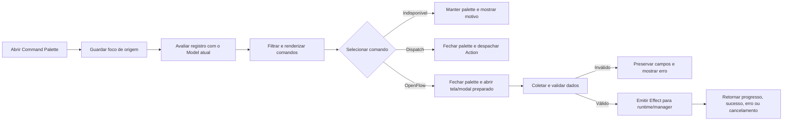

# Dexo — Design de Correção do Command Palette

**Data:** 2026-08-16  
**Status:** aprovado pelo usuário após revisão final
**Auditoria-base:** `docs/audits/2026-08-16-command-palette-audit.md`  
**Escopo:** as 129 entradas do Command Palette e os fluxos diretamente acionados por elas

## 1. Propósito

Este documento define a correção funcional do Command Palette do Dexo. O objetivo não é redesenhar a TUI nem criar um novo framework de comandos, mas garantir que cada comando anunciado:

- represente corretamente sua disponibilidade no estado atual;
- abra a tela ou modal responsável quando precisar de dados do usuário;
- mostre o alvo antes de operações contextuais ou destrutivas;
- execute a operação anunciada, sem valores fabricados ou efeitos trocados;
- apresente erro, progresso, cancelamento e resultado no local adequado;
- seja comprovado pelo caminho real de interação do palette.

A auditoria encontrou 46 comandos adequados, 45 dependentes de contexto sem guarda suficiente, 11 parciais ou enganosos e 27 quebrados. Esta especificação cobre os 129 IDs para impedir que a correção dos casos graves deixe comandos irmãos inconsistentes.

## 2. Decisões aprovadas

Foram aprovadas durante o brainstorming:

1. comandos que precisam de entrada devem abrir a tela ou modal já existente no modo correto;
2. haverá um registro contextual central de comandos;
3. a seleção será dividida entre ação direta, abertura de fluxo e confirmação destrutiva;
4. validação pertence à tela que coleta os dados;
5. operações de I/O pertencem ao runtime ou manager, nunca ao loop de atualização da TUI;
6. erros preservam o formulário e deixam o fluxo aberto para correção;
7. os 129 comandos terão um teste de contrato tabelado e os fluxos relevantes terão testes comportamentais pelo caminho real do palette.

## 3. Problema sistêmico

O registro atual associa cada entrada a uma construção de `Action` sem acesso adequado ao contexto de execução. Isso leva a três classes recorrentes de defeito:

- **argumento ausente:** `project.create` e `project.rename` enviam nome vazio em vez de abrir o formulário;
- **contexto invisível:** comandos de projeto e conexão operam sobre uma seleção interna que o usuário não vê;
- **operação divergente:** import, backup e restore chegam a um runner que sempre exporta CSV.

O problema é agravado por `action_by_id`, que reconstrói entradas usando `Model::default()`, e pela ausência de regras contextuais: somente 11 das 129 entradas possuem `disabled_reason` dinâmico.

A correção deve eliminar a possibilidade estrutural de um comando pedir dados fabricando strings vazias, nomes fixos ou seleções implícitas.

## 4. Estratégia escolhida

Será mantido um único registro, derivado do `Model` real. Cada comando possuirá um contrato explícito com:

- ID estável;
- título, categoria, palavras-chave e atalho;
- regra de disponibilidade;
- motivo de indisponibilidade;
- modo de invocação;
- destino responsável pelo restante do fluxo.

O registro será a fonte de verdade para busca, renderização, seleção, menus derivados e testes. Nenhuma resolução por ID poderá reconstruí-lo com um modelo default.

### 4.1 Modos de invocação

O contrato terá somente dois resultados técnicos, suficientes para os três comportamentos aprovados:

- `Dispatch(Action)`: operação direta já completamente determinada pelo contexto atual;
- `OpenFlow(FlowIntent)`: abre a tela/modal responsável com modo, alvo e valores iniciais explícitos.

Uma confirmação destrutiva é um `OpenFlow` cujo destino começa em estado de preview/confirm. Ela não executa mutação diretamente pelo palette.

`FlowIntent` será limitado aos fluxos que realmente precisam preparar UI. Não haverá event bus, sistema de plugins, factory, trait com uma única implementação ou framework genérico de formulários.

### 4.2 Disponibilidade

A disponibilidade será avaliada contra o `Model` exibido ao usuário. O resultado será:

- disponível;
- indisponível com motivo curto e acionável.

Exemplos:

- “Conecte uma sessão primeiro”;
- “Selecione uma tabela”;
- “Nenhum resultado disponível”;
- “Não há alterações pendentes”;
- “Este driver não oferece backup”.

Itens indisponíveis permanecem pesquisáveis, mas não são executados. Pressionar Enter neles mantém o palette aberto e apresenta o motivo; não deve haver no-op silencioso.

## 5. Fluxo de interação



Fechar o palette sem iniciar outro fluxo restaura o foco de origem. Quando um comando abre uma tela/modal, o foco passa explicitamente para o primeiro controle útil. Cancelar esse fluxo restaura o foco anterior sempre que a tela não tiver uma regra de retorno mais específica.

## 6. Responsabilidades

### 6.1 Registro do palette

O registro:

- descreve os 129 comandos;
- calcula disponibilidade e motivo;
- escolhe `Dispatch` ou `OpenFlow`;
- fornece atalho para renderização;
- nunca executa I/O;
- nunca cria argumentos fictícios.

### 6.2 Reducer/update da TUI

O reducer:

- fecha o palette somente após uma seleção válida;
- abre a tela/modal indicada;
- configura modo, alvo, valores iniciais e foco;
- emite efeitos somente após validação ou confirmação;
- mantém no `Model` apenas estado renderizável.

### 6.3 Tela ou modal proprietário

A tela responsável:

- coleta dados;
- valida campos;
- mostra alvo e impacto;
- preserva entrada após erro;
- controla confirmação e cancelamento;
- apresenta progresso e resultado.

### 6.4 Runtime e managers

O runtime ou manager:

- executa filesystem, banco, subprocesso e persistência;
- respeita o modo da operação;
- não bloqueia o loop da TUI;
- devolve ações correlacionadas de progresso, sucesso, falha ou cancelamento;
- nunca transforma import/restore em export ou confirma sucesso antes da resposta real.

## 7. Fluxos obrigatórios por domínio

### 7.1 Projetos

- `project.browse` continua abrindo a lista.
- `project.create` abre Projects em `ProjectsMode::Create`, limpa e foca `name_input`.
- `project.rename` exige projeto selecionado, abre `ProjectsMode::Rename` e preenche o nome atual.
- `project.switch` abre a lista com seleção visível; a troca ocorre somente após escolha explícita.
- `project.delete` abre preview/confirm com nome e impacto visíveis.

Nenhuma ação de projeto recebe `String::new()` como substituto de entrada.

### 7.2 Conexões e sessões

- comandos sobre conexão abrem o browser quando não houver alvo visível;
- connect, duplicate, test e delete mostram a conexão selecionada;
- delete entra no fluxo de confirmação renderizado;
- close session mostra a sessão ou conexão que será encerrada;
- a indisponibilidade explica ausência de perfil, sessão ou capacidade.

### 7.3 Transações e savepoints

- begin, commit e rollback refletem sessão, estado transacional e política read-only;
- create, rollback e release de savepoint usam entrada ou seleção visível;
- nenhum fluxo usa `"sp1"` como nome universal;
- rollback de savepoint respeita os estados aceitos pelo handler, inclusive `Failed` quando válido.

### 7.4 Dados e resultados

- copy, navegação, ações de linha e inspect exigem grid/seleção compatíveis;
- paginação valida sessão e alvo antes de alterar offset ou `loading`;
- sort abre um seletor/editor e produz estado de ordenação real;
- filter abre entrada editável, não apenas reaplica um filtro antigo;
- review exige mudanças pendentes e alvo conhecido;
- falha antes de emitir efeito não pode deixar loading ativo.

### 7.5 Explorer

- ações contextuais exigem nó e sessão quando aplicável;
- refresh valida a sessão antes de limpar estado visível;
- refresh subtree recarrega somente a subtree;
- dependências e dependentes anunciam e executam direções coerentes;
- comandos offline mantêm o snapshot existente quando não podem recarregar.

### 7.6 Schema, diff e segurança

- preview e raw DDL abrem a aba/formulário correspondente e mostram validação;
- títulos devem corresponder ao efeito real; “Apply Raw DDL” só permanece se houver aplicação;
- schema diff carrega ou solicita as duas fontes e usa o manager real antes de renderizar resultado;
- Security carrega estado real, possui teclado de fechamento e rotas explícitas de apply;
- capabilities ausentes ficam desabilitadas com motivo em vez de abrir telas vazias.

### 7.7 Transferência, import, backup e restore

Cada modo possui dispatch próprio e validado:

- Export chama exportação streaming;
- Import chama importação;
- Backup chama tooling nativo compatível com o driver;
- Restore chama tooling nativo compatível com o driver.

Origem e destino são tipos de estado distintos. Import e Restore nunca tratam o arquivo escolhido como destino de exportação. O modo, a capability, o arquivo, o alvo e a confirmação são validados antes da escrita.

O runner atual que ignora `TransferMode` será substituído ou dividido no ponto comum, corrigindo a causa raiz para todos os chamadores. I/O síncrono e cópia integral dos rows deixam o reducer.

### 7.8 Explain

O comando captura e propaga a posição real do cursor. O manager seleciona a instrução correspondente, não a primeira instrução por usar cursor zero. Sem sessão ou statement válido, o comando fica indisponível com motivo.

### 7.9 MCP

- profiles abre estado navegável coerente;
- revoke all exige perfil ou escopo explícito, preview e confirmação;
- “all” deve revogar todos os grants do escopo mostrado, não somente o primeiro perfil carregado;
- perfil ausente nunca gera revogação com nome vazio.

### 7.10 Editor, histórico e snippets

- format escolhe dialeto pela conexão/documento;
- snippets são carregados antes da seleção ou sob demanda na abertura;
- accept completion fica indisponível sem completion;
- parameters abre/submete somente o fluxo de parâmetros e nunca executa query fora dele;
- clear history informa escopo e pede confirmação adequada.

### 7.11 Settings, recovery e diagnostics

- reset settings e discard recovery usam confirmação renderizada, não segundo Enter oculto;
- restore recovery mostra pré-condições e alvo;
- diagnostics abre escolha de destino, chama `DiagnosticBundle::write_zip` no runtime e apresenta o caminho final;
- preview e erros de diagnostics possuem ação de fechamento por teclado.

## 8. Renderização e foco

O renderer do palette exibirá o atalho já registrado. Título, categoria, atalho e indisponibilidade devem caber no layout atual sem introduzir uma nova tela.

O modelo guardará o foco de origem enquanto o palette estiver aberto. As regras são:

1. Esc restaura o foco de origem;
2. seleção indisponível mantém o palette e o foco;
3. ação direta restaura o foco, salvo quando a própria ação escolhe outro painel;
4. `OpenFlow` define foco no primeiro campo ou alvo relevante;
5. cancelamento do modal retorna ao foco anterior aplicável.

## 9. Validação, erros e segurança de dados

- validação ocorre antes de efeitos mutáveis;
- erro de validação preserva campos e seleção;
- erro de runtime mantém a tela aberta quando o usuário puder corrigir ou tentar novamente;
- loading sempre termina em sucesso, erro ou cancelamento;
- operações destrutivas exibem alvo e impacto;
- mensagens temporárias servem apenas para resultados simples;
- erro que exige ação permanece visível;
- nenhuma mensagem de sucesso nasce antes do resultado de I/O;
- import, restore e backup possuem testes negativos contra sobrescrita da origem;
- dados sensíveis continuam sanitizados em mensagens e diagnostics.

## 10. Compatibilidade

Os 129 IDs permanecem estáveis para preservar keymaps, documentação e hábitos do usuário. IDs só poderão ser removidos se forem duplicatas reais e houver migração explícita; esta correção não prevê remoções.

Os comandos adequados continuam usando seus handlers atuais. Eles recebem apenas guards contextuais ou ajuste de foco quando necessário. O trabalho deve preferir reutilizar screens, modes, managers e effects já existentes.

Não há migration de storage prevista apenas para o registro contextual. Se um fluxo revelar persistência ausente, a migration deverá ser limitada ao requisito funcional daquele domínio.

## 11. Estratégia de testes

### 11.1 Contrato dos 129 comandos

Um teste tabelado lista todos os IDs e verifica:

- unicidade;
- metadados mínimos;
- atalho renderizável quando definido;
- disponibilidade no contexto preparado;
- motivo quando indisponível;
- resultado `Dispatch` ou `OpenFlow` esperado.

Esse teste deve falhar quando um novo comando for registrado sem caso de contrato.

### 11.2 Caminho real do palette

Os testes comportamentais simulam:

```text
OpenPalette -> digitar busca -> selecionar resultado -> Enter
```

Eles não chamam diretamente o handler final como substituto da interação. Devem provar abertura, modo, alvo, foco, valores iniciais, validação, confirmação e efeito emitido.

### 11.3 Regressões críticas

Casos obrigatórios:

- create, rename, switch e delete de projeto;
- connect, duplicate, test, delete e close session;
- savepoints sem nome fixo;
- page next/prev sem loading órfão;
- sort e filter com entrada visível;
- refresh offline e refresh subtree;
- schema diff carregado;
- Security carregável e fechável;
- Export, Import, Backup e Restore despachando implementações diferentes;
- proteção contra sobrescrita da origem;
- Explain usando cursor real;
- revoke all com escopo e confirmação;
- snippets carregados;
- parameters sem execução acidental;
- settings/recovery com confirmação visível;
- diagnostics escrevendo ZIP e fechando overlay;
- restauração de foco;
- atalho renderizado.

### 11.4 Divisão dos testes

- teste de registro: metadados, disponibilidade e intenção;
- teste de reducer: preparação de tela e emissão de efeito;
- teste de runtime/manager: operação real por modo e resultado correlacionado;
- teste renderizado: campos, alvo, confirmação, erro e atalho visíveis;
- integração de driver/filesystem somente onde a operação cruza essa fronteira.

Snapshots continuam úteis para layout, mas não substituem assertions comportamentais.

## 12. Gates de aceitação

A correção só termina quando:

1. os 129 comandos constam no contrato tabelado;
2. nenhum comando constrói argumento obrigatório vazio ou nome fixo;
3. nenhum comando contextualmente inválido fecha o palette ou executa no-op silencioso;
4. nenhuma operação destrutiva do palette pula confirmação visível;
5. Import, Backup e Restore não alcançam o exportador;
6. nenhum I/O de transferência bloqueia o reducer;
7. managers hoje desconectados pelos fluxos auditados possuem chamador real ou o comando fica honestamente indisponível;
8. todos os effects alcançáveis no escopo possuem handler funcional;
9. o caminho real do palette possui cobertura para todos os fluxos críticos;
10. `cargo fmt`, `cargo clippy` e a suíte relevante ficam verdes, incluindo snapshots revisados conscientemente.

## 13. Ordem recomendada de correção

```text
Contrato e foco do palette
  -> Projetos, conexões e confirmações
  -> Transferência e proteção de dados
  -> Schema diff, Security, Diagnostics e MCP
  -> Dados, Explorer, Editor e Explain
  -> Contrato completo dos 129 comandos e gates
```

Transferência tem prioridade sobre melhorias cosméticas porque o comportamento atual pode sobrescrever arquivos. O registro contextual vem primeiro porque elimina a causa comum de argumentos vazios, seleções invisíveis e comandos sem guards.

## 14. Fora de escopo

- criar um sistema extensível de plugins para comandos;
- redesenhar visualmente todas as telas;
- trocar keymap ou IDs por preferência estética;
- refatorar crates não alcançados pelos comandos auditados;
- considerar o projeto inteiro concluído apenas porque o palette ficou verde.

Defeitos subjacentes necessários para cumprir um comando permanecem dentro do escopo, mesmo quando estiverem fora de `palette.rs`.

## 15. Riscos e mitigação

### 15.1 Registro continuar monolítico

Mitigação: separar dados repetitivos somente se isso reduzir o arquivo durante a implementação. Não criar camadas abstratas antes de o contrato real exigir.

### 15.2 Corrigir o palette e preservar manager desconectado

Mitigação: cada teste crítico atravessa `palette -> reducer -> effect -> runtime/manager -> action de resultado`.

### 15.3 Guards esconderem funcionalidades

Mitigação: comandos indisponíveis permanecem pesquisáveis e explicam como satisfazer a pré-condição.

### 15.4 Snapshots darem falsa confiança

Mitigação: snapshot comprova renderização; assertions explícitas comprovam comportamento e I/O.

### 15.5 Escopo crescer para reescrever toda a TUI

Mitigação: reutilizar os modos, screens e managers existentes; adicionar apenas os estados e effects exigidos pelos comandos auditados.

## 16. Definition of Done

O Command Palette estará corrigido quando cada um dos 129 IDs estiver em uma destas condições verificadas:

- executa corretamente uma ação direta no contexto válido;
- abre a tela/modal existente no modo correto, com entrada e alvo visíveis;
- fica indisponível com motivo verdadeiro quando a capacidade não existe.

Não haverá comando habilitado que falhe por dado que o usuário nunca teve oportunidade de fornecer, opere sobre seleção invisível, execute operação diferente da anunciada ou deixe a interface em estado incompleto.
